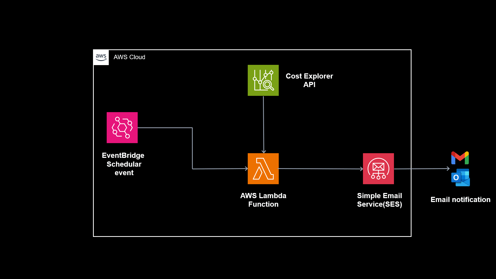

# Automated AWS Cost Report Generation and Email Notification

### [View all Roadmaps](https://github.com/nholuongut/all-roadmaps) &nbsp;&middot;&nbsp; [Best Practices](https://github.com/nholuongut/all-roadmaps/blob/main/public/best-practices/) &nbsp;&middot;&nbsp; [Questions](https://www.linkedin.com/in/nholuong/)
 

Automated AWS Cost Report Generation and Email Notification is a project that aims to simplify the process of monitoring and managing AWS costs. By automating the generation of cost reports and sending email notifications, this project provides valuable insights and helps businesses make informed decisions to optimize their AWS spending.

## Table of Contents

- [Introduction](#introduction)
- [Prerequisites](#prerequisites)
- [Implementation Options](#implementation-options)
  - [Manual Setup](#manual-setup)
  - [Terraform Setup](#terraform-setup)
- [Getting Started](#getting-started)
- [Usage](#usage)
- [Contributing](#contributing)
- [License](#license)

## Introduction

In today's cloud-based infrastructure, managing costs is a crucial aspect for businesses. AWS offers a comprehensive set of tools and services to monitor and optimize costs, but keeping track of expenses can still be a daunting task. This project aims to automate the generation of cost reports and provide regular email notifications for daily and monthly cost insights.

The solution utilizes AWS Lambda, Amazon EventBridge, and Amazon SES (Simple Email Service) to automate the process. By following the provided instructions, you will be able to set up the cost management system and start receiving cost reports directly in your email inbox.

## Prerequisites

Before getting started, make sure you have the following prerequisites in place:

- An active AWS account with appropriate permissions.
- Familiarity with AWS Lambda, EventBridge, and SES.
- IAM role with necessary permissions for accessing AWS Cost Explorer API and sending emails.

## Implementation Options

You can choose between two implementation options: manual setup through the AWS Management Console or infrastructure-as-code using Terraform. Both approaches will enable you to automate AWS cost reporting and email notifications.

### Manual Setup

The manual setup approach involves configuring the necessary AWS services and resources through the AWS Management Console. This approach is suitable for users who prefer a hands-on approach and want to understand the individual components and their configurations.

### Terraform Setup

For users who prefer infrastructure-as-code and want to automate resource provisioning, a Terraform implementation is available. Terraform allows for repeatable and version-controlled deployments of the cost management system. You can find the complete Terraform code and instructions in the [GitHub repository](https://github.com/nholuongut/terraform-for-aws.git). Follow the provided instructions to set up the cost management system using Terraform.

## Getting Started

To get started with the project, follow these steps:

1. Clone the repository: `git clone https://github.com/nholuongut/terraform-for-aws.git`
2. Set up the necessary AWS resources based on your chosen implementation option.
3. Configure the Lambda function and EventBridge rule as per the instructions.
4. Update the email addresses and other configurations as required.
5. Deploy the solution and ensure everything is working correctly.

## Usage

Once the setup is complete, the cost management system will automatically generate cost reports and send email notifications based on the defined schedule. You will start receiving daily and monthly cost insights in your email inbox.

Feel free to explore the code and make any necessary modifications to suit your specific requirements.

# 🚀 I'm are always open to your feedback.  Please contact as bellow information:
### [Contact ]
* [Name: nho Luong]
* [Skype](luongutnho_skype)
* [Github](https://github.com/nholuongut/)
* [Linkedin](https://www.linkedin.com/in/nholuong/)
* [Email Address](luongutnho@hotmail.com)

# License
* Nho Luong (c). All Rights Reserved.🌟
