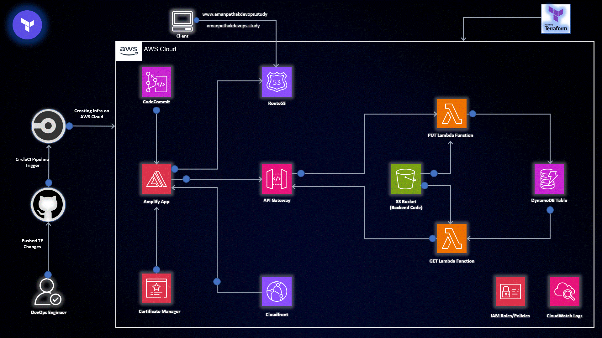

# AWS Serverless Project(Services like Amplify App, S3 Bucket, Lambda Function, DynamoDB Table, API Gateway and IAM Roles)

### [View all Roadmaps](https://github.com/nholuongut/all-roadmaps) &nbsp;&middot;&nbsp; [Best Practices](https://github.com/nholuongut/all-roadmaps/blob/main/public/best-practices/) &nbsp;&middot;&nbsp; [Questions](https://www.linkedin.com/in/nholuong/)
 

AWS Serverless Service based project that aims to deploy frontend (HTML, CSS and JS), backend (Python) and Database (No SQL DB) on AWS Services like Amplify App, S3 Bucket, Lambda Function, DynamoDB Table, API Gateway and IAM Roles and deploy the infra using CircleCI CI/CD tool.

## Table of Contents

- [Introduction](#introduction)
- [Prerequisites](#prerequisites)
- [Implementation Options](#implementation-options)
  - [Manual Setup](#manual-setup)
  - [Terraform Setup](#terraform-setup)
- [Getting Started](#getting-started)
- [Usage](#usage)
- [CircleCI Integration](#circleci-integration)
- [Contributing](#contributing)
- [License](#license)

## Introduction

In the world of serverless architecture, this project takes a comprehensive approach to deploy a full-stack application using AWS Serverless Services. From the frontend to backend and database, all components are seamlessly integrated for a scalable and efficient deployment.

## Prerequisites

Before diving into the deployment process, make sure you have the following prerequisites in place:

- An active AWS account with the necessary permissions.
- Familiarity with AWS Amplify, S3, Lambda, DynamoDB, API Gateway, and IAM Roles.
- Basic understanding of Terraform for the infrastructure-as-code (IaC) approach.
- Basic understanding of CircleCI CI/CD tool to automate the Infra.

## Implementation Options

This project provides two implementation options to cater to different preferences:

## Getting Started

Follow these steps to initiate the deployment:

1. Clone the repository: `git clone https://github.com/nholuongut/terraform-for-aws.git`
2. Choose your preferred implementation option (Manual or Terraform) and configure the necessary AWS resources.
3. Customize Lambda functions, API Gateway, IAM Roles, and other components based on your application's requirements.
4. Go to the Project Directory `Non-Modularized/AWS-Serverless-Project`
5. Deploy the solution and ensure everything works correctly.

## Usage

Once deployed, your application will be hosted on AWS Serverless Services, providing a scalable and cost-effective environment. Users can access your application through the provided Amplify App link where you mapped your domain name.

Feel free to explore the code, make modifications, and adapt it to suit your specific application requirements.

## CircleCI Integration

This project leverages CircleCI for continuous integration and deployment. The CI/CD pipeline is configured to automatically build, test, and deploy changes to your AWS Serverless application. The build status can be tracked using the CircleCI badge above.

To integrate CircleCI with your fork or copy of this repository, follow these steps:

1. [Sign up](https://circleci.com/signup/) or [log in](https://circleci.com/login/) to CircleCI.
2. Connect your GitHub account and add your repository.
3. Configure the `.circleci/config.yml` file to match your project's structure and requirements.
4. Push a commit to trigger the initial build and deployment on CircleCI.
5. Monitor the build status on the CircleCI dashboard.

## Contributing

Contributions are welcome! If you encounter issues or have suggestions for improvements, please submit a pull request.

# 🚀 I'm are always open to your feedback.  Please contact as bellow information:
### [Contact ]
* [Name: nho Luong]
* [Skype](luongutnho_skype)
* [Github](https://github.com/nholuongut/)
* [Linkedin](https://www.linkedin.com/in/nholuong/)
* [Email Address](luongutnho@hotmail.com)

# License
* Nho Luong (c). All Rights Reserved.🌟
