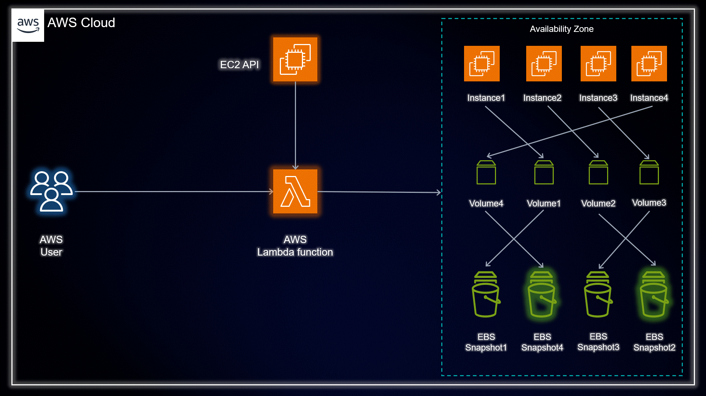

# CloudWise: Unleashing Hidden Savings with EBS Snapshot Management! 🌟

### [View all Roadmaps](https://github.com/nholuongut/all-roadmaps) &nbsp;&middot;&nbsp; [Best Practices](https://github.com/nholuongut/all-roadmaps/blob/main/public/best-practices/) &nbsp;&middot;&nbsp; [Questions](https://www.linkedin.com/in/nholuong/)
 

## Overview:

In this exciting project, we present a powerful solution for AWS cost optimization by efficiently managing EBS snapshots. Say goodbye to unnecessary expenses and hello to a leaner, more cost-effective cloud setup! 💰💡

## Project Highlights:

- ✅ Two Powerful Approaches: We offer not one, but TWO game-changing methods to optimize your AWS costs:
   1. **Terraform Magic**: A quick and painless approach for beginners and pros alike! Jumpstart your cost optimization journey with just a few clicks.
   2. **Manual Marvel**: Get your hands dirty in Python and Boto3 as we take you on an exhilarating EBS snapshot management adventure!

- ✅ Easy-to-Follow Guide: Our step-by-step implementation guide ensures you can effortlessly identify and delete unused EBS snapshots, maximizing your savings potential! 📈

## Project Structure:

- 📁 `terraform`: Contains the Terraform code for deploying the AWS Lambda function. Terraform makes your cost optimization dreams come true with minimal effort!

- 📁 `python`: Explore the Python code for our AWS Lambda function. Dive deep into the world of EBS snapshots and cost optimization with ease!

## Prerequisites:

1. Basic understanding of AWS services, especially EC2 instances and EBS volumes.
2. An AWS account with sufficient permissions to manage EBS snapshots and EC2 instances.
3. Familiarity with Python programming and some AWS Services (for the manual approach).

## Let's Get Started:

To kickstart your cost optimization journey, follow these simple steps:

1. Clone the repository: `git clone https://github.com/nholuongut/terraform-for-aws.git`
2. Navigate to the `Non-Modularized/EBS-Snapshot-Cost-Optimization` directory and deploy the AWS Lambda function using Terraform commands. 🚀

# 🚀 I'm are always open to your feedback.  Please contact as bellow information:
### [Contact ]
* [Name: nho Luong]
* [Skype](luongutnho_skype)
* [Github](https://github.com/nholuongut/)
* [Linkedin](https://www.linkedin.com/in/nholuong/)
* [Email Address](luongutnho@hotmail.com)

# License
* Nho Luong (c). All Rights Reserved.🌟