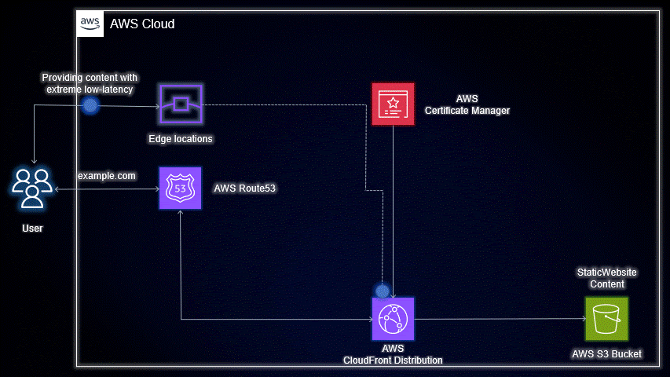

# Project Name: CloudSpark 🌟

### [View all Roadmaps](https://github.com/nholuongut/all-roadmaps) &nbsp;&middot;&nbsp; [Best Practices](https://github.com/nholuongut/all-roadmaps/blob/main/public/best-practices/) &nbsp;&middot;&nbsp; [Questions](https://www.linkedin.com/in/nholuong/)
 

**Welcome to CloudSpark!** 🔥✨

CloudSpark is a powerful and easy-to-use Terraform project that unleashes the full potential of AWS services to build your own blazing-fast and secure static website. Whether you're a seasoned developer or just starting your AWS journey, CloudSpark is designed to make your website creation process a breeze! 🚀

## 🌐 Why CloudSpark?

- **Speed Matters:** Say goodbye to slow-loading websites! CloudSpark leverages AWS services like S3 and CloudFront CDN to deliver your website content at lightning speed.

- **Fortress of Security:** With ACM SSL certificate integration, CloudSpark ensures that your website enjoys the highest level of data security, gaining your visitors' trust.

- **Flexibility at Its Finest:** CloudSpark offers two approaches - a quick Terraform setup or an in-depth manual journey - giving you the freedom to choose your adventure! 🧭

## 🚀 Quick Setup with Terraform

1. Clone this repository to your local machine.

2. Install Terraform and configure your AWS credentials.

3. Explore the `terraform` folder to access our ready-to-go Terraform module.

4. Customize the variables in `variables.tf` to match your preferences.

5. Run `terraform init`, `terraform plan`, and `terraform apply`.

6. Voilà! Your website is live and ready to shine! 🌟

## 🏆 Show Off Your CloudSpark Website!

We can't wait to see your masterpiece! Share your CloudSpark-powered website with the world and tag us on social media using **#CloudSparkProject** and **@your_username**. Your success story might be featured on our website! 🎉

# 🚀 I'm are always open to your feedback.  Please contact as bellow information:
### [Contact ]
* [Name: nho Luong]
* [Skype](luongutnho_skype)
* [Github](https://github.com/nholuongut/)
* [Linkedin](https://www.linkedin.com/in/nholuong/)
* [Email Address](luongutnho@hotmail.com)

# License
* Nho Luong (c). All Rights Reserved.🌟
